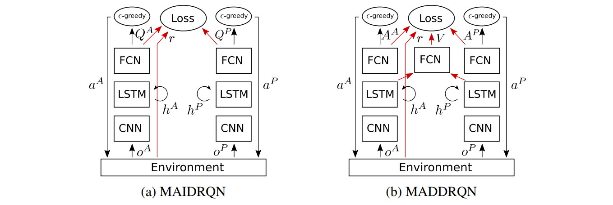
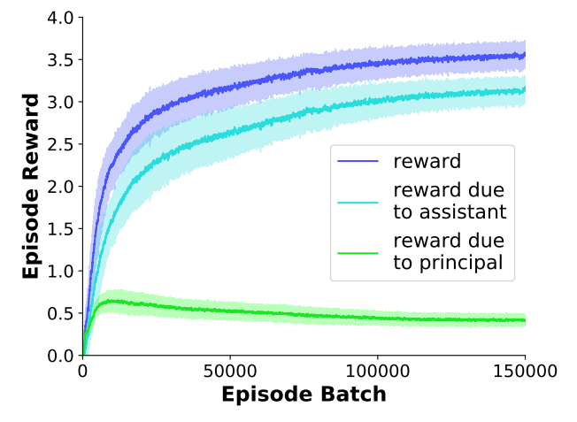
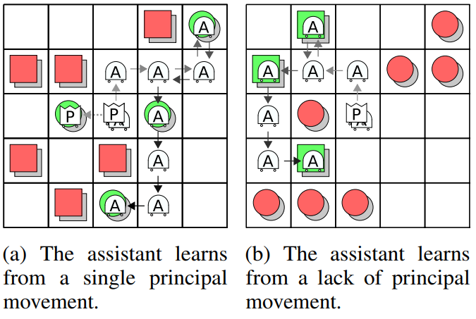
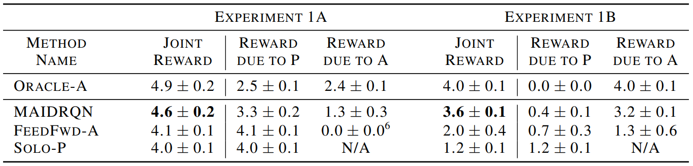
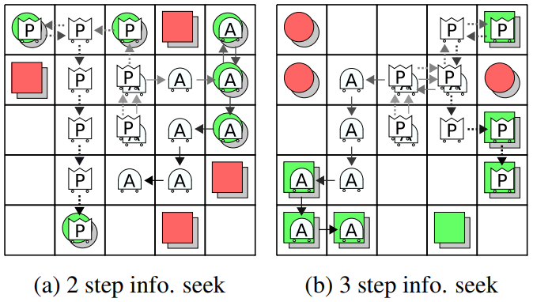
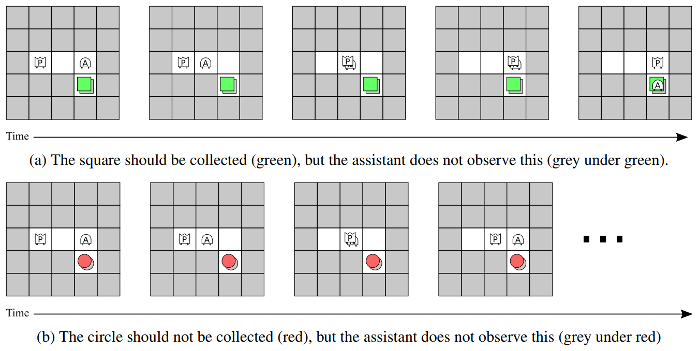

## Abstract

When deploying autonomous agents in the real world, we need to think about effective ways of communicating our objectives to them. 
Traditional skill learning has revolved around reinforcement and imitation learning, each with their own constraints on the format and temporal distribution with which information between the human and the agent is exchanged.
In contrast, when humans communicate with each other, they make use of a large vocabulary of informative behaviors, including non-verbal communication, which help to disambiguate their message throughout learning. 
Communicating throughout learning allows them to identify any missing information, whereas the large vocabulary of behaviors helps with selecting appropriate behaviors for communicating the required information.
In this paper, we introduce a multi-agent training framework, which emerges physical information-communicating behaviors. 
The agent is trained, on a variety of tasks, with another agent, who knows the task and serves as a human surrogate.
Our approach produces an agent that is capable of learning interactively from a human user, without a set of explicit demonstrations or a reward function.
We conduct user experiments on object gathering tasks with pixel observations, and confirm that the trained agent learns from the human and that the joint performance significantly exceeds the performance of the human acting alone.
Further, through a series of experiments, we demonstrate the emergence of a variety of learning behaviors, including information-sharing, information-seeking, and question-answering.

[here]: https://interactive-learning.github.io

  <!--div style="margin: 0px auto"-->
  <!--div style="margin: 0px auto; max-width: 800px"-->
  

    <!--div id="gameContainer"></div-->
    <!--div id="gameContainer" style="max-width: 800px; max-height: 450px"></div-->
    

    

      

    

  

  <!--div id="my_unity_game"></div-->
<figcaption>
Game 1. Play a fruit collecting game with the trained assistant. Trying playing from an overhead view (press "v"). This introduces additional partial observability and is how the human participants and the agents observe the world. Also, try to score as low as possible, collecting the "wrong" fruit.
</figcaption>

______

## 1&nbsp;&nbsp;Introduction

Many tasks that we would like our agents to perform, such as unloading a dishwasher, straightening a room, or restocking shelves are inherently user-specific, requiring information from the user in order to fully learn all the intricacies of the task.
The traditional paradigm for agents to learn such tasks is through rewards and demonstrations.
However, iterative reward engineering with untrained human users is impractical in real-world settings, while demonstrations are often burdensome to provide.
In contrast, humans learn from a variety of interactive communicative behaviors, including nonverbal gestures and partial demonstrations, each with their own information capacity and effort.
Can we enable agents to learn tasks from humans through such unstructured interaction, requiring minimal effort from the human user?

The effort required by the human user is affected by many aspects of the learning problem, including restrictions on when the agent is allowed to act and restrictions on the behavior space of either human or agent, such as limiting the user feedback to rewards or demonstrations.
We consider a setting where both the human and the agent are allowed to act throughout learning, which we refer to as _interactive learning_.
Unlike collecting a set of demonstrations before training, interactive learning allows the user to selectively act only when it deems the information is necessary and useful, reducing the user's effort.
Examples of such interactions include allowing user interventions, or agent requests, for demonstrations <dt-cite key="kelly2018hgd"></dt-cite>, rewards <dt-cite key="warnell2018dti,arumugam2019drl"></dt-cite>, or preferences <dt-cite key="christiano2017drl"></dt-cite>.
While these methods allow the user to provide feedback throughout learning, the communication interface is restricted to structured forms of supervision, which may be inefficient for a given situation.
For example, in a dishwasher unloading task, given the history of learning, it may be sufficient to point at the correct drawer rather than provide a full demonstration. 

To this end, we propose to allow the agent and the user to exchange information through an unstructured interface. 
To do so, the agent and the user need a common prior understanding of the meaning of different unstructured interactions, along with the context of the space of tasks that the user cares about. 
Indeed, when humans communicate tasks to each other, they come in with rich prior knowledge and common sense about what the other person may want and how they may communicate that, enabling them to communicate concepts effectively and efficiently <dt-cite key="peloquin2019irp"></dt-cite>.

In this paper, we propose to allow the agent to acquire this prior knowledge through joint pre-training with another agent who knows the task and serves as a human surrogate. 
The agents are jointly trained on a variety of tasks, where actions and observations are restricted to the physical environment.
Since the first agent is available to assist, but only the second agent is aware of the task, interactive learning behaviors should emerge to accomplish the task efficiently.
We hypothesize that, by restricting the action and observation spaces to the physical environment, the emerged behaviors can transfer to learning from a human user. 
An added benefit of our framework is that, by training on a variety of tasks from the target task domain, much of the non-user specific task prior knowledge is pre-trained into the agent, further reducing the effort required by the user.

We evaluate various aspects of agents trained with our framework on several simulated object gathering task domains, including a domain with pixel observations, shown in Figure 1.
We show that our trained agents exhibit emergent information-gathering behaviors in general and explicit question-asking behavior where appropriate.
Further, we conduct a user study with trained agents, where the users score significantly higher with the agent than without the agent, which demonstrates that our approach can produce agents that can learn from and assist human users.

<figcaption>
Figure 1. Episode traces after 100, 1k, and 40k pre-training steps for the cooperative fruit collection domain of Experiment 4. The principal agent “P” (pink) is told the fruit to be collected, lemons or plums, in its observations. Within an episode, the assistant agent “A” (blue) must infer the fruit to be collected from observations of the principal. Each agent observes an overhead image of itself and its nearby surroundings. By the end of training(c) the assistant is inferring the correct fruit and the agents are coordinating. This inference and coordinationtransfers to human principals (d).
</figcaption>

The key contribution of our work is a training framework that allows agents to quickly learn new tasks from humans through unstructured interactions, without an explicitly-provided reward function or demonstrations. 
Critically, our experiments demonstrate that agents trained with our framework generalize to learning test tasks from human users, demonstrating interactive learning with a human in the loop.
In addition, we introduce a novel multi-agent model architecture for cooperative multi-agent training that exhibits improved training characteristics. 
Finally, our experiments on a series of object-gathering task domains illustrate a variety of emergent interactive learning behaviors and demonstrate that our method can scale to raw pixel observations.

## 2&nbsp;&nbsp;Related Work

The traditional means of passing task information to an agent include specifying a reward function <dt-cite key="barto1998rli,bertsekas1996ndp"></dt-cite> that can be hand-crafted for the task <dt-cite key="singh2009rewards,levine2016end,chebotar-hausman-zhang17icml"></dt-cite> and providing demonstrations<dt-cite key="schaal1999ilr,abbeel2004apprenticeship"></dt-cite> before the agent starts training.
More recent works explore the concept of the human supervision being provided throughout training by either providing rewards during training <dt-cite key="warnell2018dti,thomaz2005rti,isbell2001cas,dattari2018ilc"></dt-cite> or demonstrations during training; either continuously <dt-cite key="kelly2018hgd,ross2011ari"></dt-cite> or at the agent's discretion <dt-cite key="xu2018lpi,hester2018dqd,james2018tec,yu2018osi,borsa2017olr,krening2018naa,ross2011reduction,brown2018raa"></dt-cite>.
In all of these cases, however, the reward and demonstrations are the sole means of interaction.

Another recent line of research involves the human expressing their preference between agent generated trajectories <dt-cite key="christiano2017drl,mindermann2018air,ibarz2018rlh"></dt-cite>.
Here again, the interaction is restricted to a single modality.

Our work builds upon the idea of meta-learning, or learning to learn <dt-cite key="schmidhuber1987eps,thrun2012learningtolearn,bengio1991lsl"></dt-cite>. Meta-learning for control has been considered in the context of reinforcement learning <dt-cite key="duan2016rl2,wang2016learning,finn2017mam"></dt-cite> and imitation learning <dt-cite key="duan2017one,yu2018one"></dt-cite>. 
Our problem setting differs from these, as the agent is learning by observing and interacting with another agent, as opposed to using reinforcement or imitation learning. 
In particular, our method builds upon recurrence-based meta-learning approaches <dt-cite key="santoro2016osl,duan2016rl2,wang2016learning"></dt-cite> in the context of the multi-agent task setting.

When a broader range of interactive behaviors is desired, prior works have introduced a multi-agent learning component <dt-cite key="potter1994cca,palmer2018lma,matignon2007hql"></dt-cite>.
These methods are more closely related to ours in that, during training, they also maximize a joint reward function between the agents and emerge cooperative behavior <dt-cite key="gupta2017cmc,foerster2018cma,foerster2016lcd,lazaridou2016mce,andreas2017tn"></dt-cite>.
Multiple works <dt-cite key="gupta2017cmc,foerster2018cma"></dt-cite> emerge cooperative behavior but in task domains that do not require knowledge transfer between the agents, while others <dt-cite key="foerster2016lcd,mordatch2018egc,lowe2017maa,lazaridou2016mce,andreas2017tn"></dt-cite> all emerge communication over a communication channel. Such communication is known to be difficult to interpret <dt-cite key="lazaridou2016mce"></dt-cite>, without post-inspection <dt-cite key="mordatch2018egc"></dt-cite> or a method for translation <dt-cite key="andreas2017tn"></dt-cite>. Critically, none of these prior works conduct user experiments to evaluate transfer to humans.

<dt-cite key="mordatch2018egc">Mordatch and Abbeel</dt-cite> experiment with tasks similar to ours, in which information must be communicated between the agents, and communication is restricted to the physical environment. This work demonstrates the emergence of pointing, demonstrations, and pushing behavior. Unlike this prior approach, however, our algorithm does not require a differentiable environment. We also demonstrate our method with pixel observations and conduct a user experiment to evaluate transfer to humans.

## 3&nbsp;&nbsp;Preliminaries

In this section, we review the cooperative partially observable Markov game <dt-cite key="littman1994mgf"></dt-cite>, which serves as the foundation for tasks in [Section 4](#methods).
A cooperative partially observable Markov game is defined by the tuple $\langle$ $\mathcal{S}$, {$\mathcal{A}^i$}, $T$, $\mathcal{R}$, {$\Omega^i$}, {$O^i$}, $\gamma$, $H$ $\rangle$, where $i\in\{1..N\}$ indexes the agent among $N$ agents,
$\mathcal{S}$, $\mathcal{A}^i$, and $\Omega^i$ are state, action, and observation spaces, 
$T:\mathcal{S} \times \{\mathcal{A}^i\} \times \mathcal{S}' \rightarrow \mathbb{R}$ is the transition function,
$\mathcal{R}:\mathcal{S} \times \{\mathcal{A}^i\} \times \mathbb{R} \rightarrow \mathbb{R}$ is the reward function,
$O^i: \mathcal{S} \times \Omega^i \rightarrow \mathbb{R}$ are the observation functions,
$\gamma$ is the discount factor,
and $H$ is the horizon.

The functions $T$ and $O^i$ are not accessible to the agents. At time $t$, the environment accepts actions $\{a_t^i\} \in \{\mathcal{A}^i\}$, samples $s_{t+1} \sim T(s_t, \{a^i_t\})$, and returns reward $r_t \sim \mathcal{R}(s_t, \{a^i_t\})$ and observations $\{o^i_{t+1}\} \sim \{O^i(s_{t+1})\}$.
The objective of the game is to choose actions to maximize the expected discounted sum of future rewards:

$\arg\!\max_{\{a^i_{t_0}|o^i_{t_0}\}} \mathbb{E}_{s,o^i,r} \big[ \sum_{t=t_0}^H \gamma^{t-t_0} r_t) \big]$

Note that, while the action and observation spaces vary for the agents, they share a common reward which leads to a cooperative task.

## 4&nbsp;&nbsp;The LILA Training Framework

We now describe our training framework for producing an assisting agent that can learn a task interactively from a human user.
We define a task to be an instance of a cooperative partially observable Markov game as described in [Section 3](#preliminaries), with $N = 2$.
To enable the agent to solve such tasks, we train the agent, 
whom we call the "assistant" (superscript $A$), jointly with another agent, whom we call the "principal" (superscript $P$) on a variety of tasks. Critically, the principal's observation function informs it of the task.
The principal agent acts as a human surrogate which allows us to replace it with a human once the training is finished.
By informing the principal of the current task
and withholding rewards and gradient updates until the end of each task, the agents are encouraged to emerge interactive learning behaviors in order to inform the assistant of the task and allow them to contribute to the joint reward.
We limit actions and observations to the physical environment, with the hope of emerging human-compatible behaviors.
Our tasks are similar to tasks in <dt-cite key="hadfield2016cir">Hadfield-Menell et  al.</dt-cite>, but with partially observable state and without access to the other agent's actions, which should better generalize to learning from humans in natural environment.

In order to train the agents, we consider two different models. We first introduce a simple model that we find works well in tabular environments. Then, in order to scale our approach to pixel observations, we introduce a modification to the first model that we found was important in increasing the stability of learning.

<figcaption>
Figure 2. Information flow for the two models used in our experiments; red paths are only needed during training. The MADDRQN model b uses a centralized value-function with per-agent advantage functions. The centralized value function is only used during training. The MAIDRQN model (a) is used in experiments 1-3 and the MADDRQN model (b) is used in experiment 4 where it exhibits superior training characteristics for learning from pixels.
</figcaption>

**Multi-Agent Independent DRQN (MAIDRQN):** 
The first model uses two deep recurrent $Q$-networks (DRQN) <dt-cite key="hausknecht2015drq"></dt-cite> that are each trained with Q-learning <dt-cite key="watkins1989ldr"></dt-cite>.
Let $Q_{\theta^i}(a^i_t, o^i_t, h^i_t)$ be the action-value function for agent $i$, which maps from the current action, observation, and history, $h^i_t$, to the expected discounted sum of future rewards.
The MAIDRQN method optimizes the following loss:

$\mathcal{L}^{\text{MAIDRQN}} := \frac{1}{N}\sum_{i,t}[r_t + \gamma \max_{a^i_{t+1}}Q_{\theta^i}(o^i_{t+1}. a^i_{t+1}, h^i_{t+1}) - Q_{\theta^i}(o_t,a_t,h_t)]^2$.

The networks are trained simultaneously on the same transitions, but do not share weights and gradient updates are made independently for each agent.
The model architecture is a recurrent neural network, depicted in Figure 2a; see the paper for details. 
We use this model for experiments 1-3.

**Multi-Agent Dueling DRQN (MADDRQN):**
With independent Q-Learning, as in MAIDRQN, the other agent's changing behavior and unknown actions make it difficult to estimate the Bellman target, $r+\gamma \max Q()$ in $\mathcal{L}^{\text{MAIDRQN}}$, which leads to instability in training. This model addresses part of the instability that is caused by unknown actions.

If $Q^*(o,a)$ is the optimal action-value function, then the optimal value function is $V^*(o) = \arg\!\max_aQ^*(o,a)$, and the optimal advantage function is defined as $A^*(o,a) = Q^*(o,a) - V^*(o)$ <dt-cite key="wang2015dna"></dt-cite>. The advantage function captures how inferior an action is to the optimal action in terms of the expected sum of discounted future rewards. This allows us to express $Q$ in a new form, $Q^*(o,a) = V^*(o) + A^*(o,a)$. We note that the value function is not needed when selecting actions: $\arg\!\max_aQ^*(o,a) = \arg\!\max_a(V^*(o) + A^*(o,a)) = \arg\!\max_aA^*(o,a)$. We leverage this idea by making the following approximation to an optimal, centralized action-value function for multiple agents: 

$Q^*(\{o^i,a^i\}) = V^*(\{o^i\}) + A^*(\{o^i,a^i\}) \approx  V^*(\{o^i\}) + \sum_iA^{i*}(o^i, a^i)$,

where $A^{i*}(o^i, a^i)$ is an advantage function for agent $i$ and $V^*(\{o^i\})$ is a joint value function.

The training loss for this model, assuming the use of per-agent recurrent networks, is:

$\mathcal{L}^{\text{MADDRQN}} := \sum_{t}[r_t + \gamma\max_{\{a^i_{t+1}\}}Q_{\{\theta^i\},\phi}(\{o^i_{t+1},a^i_{t+1},h^i_{t+1}\}) - Q_{\{\theta^i\},\phi}(\{o^i_t,a^i_t,h^i_t\})]^2$,

where

$Q_{\{\theta^i\},\phi}(\{o^i_t,a^i_t\}) := V_\phi(\{o^i_t\}) + \sum_iA_{\theta^i}(o^i_t,a^i_t)$.

Once trained, each agent selects their actions according to their advantage function $A_{\theta^i}$, $a^i_t = \arg\!\max_aA_{\theta^i}(o^i_t, a, h^i_t)$, as opposed to their Q-function $Q_{\theta^i}$ in the case of MAIDDRQN.

In the loss for the MAIDRQN model, $\mathcal{L}^{\text{MAIDRQN}}$, there is a squared error term for each $Q_{\theta^i}$ which depends on the joint reward $r$. This means that, in addition to estimating the immediate reward due their own actions, each $Q_{\theta^i}$ must estimate the immediate reward due to the actions of the other agents, without access to their actions or observations. By using a joint action value function and decomposing it into advantage functions and a value function, each $A_{\theta^i}$ can ignore the immediate reward due to the other agent, simplifying the optimization.

We refer to this model as a multi-agent dueling deep recurrent $Q$-network (MADDRQN), in reference to the single agent dueling network of <dt-cite key="wang2015dna">Wang et al.</dt-cite>. The MADDRQN model, which uses a recurrent network, is depicted in Figure 2b; See the paper for details. The MADDRQN model is used in experiment 4.

**Training Procedure:**
We use a standard episodic training procedure, with the task changing on each episode. 
Here, we describe the training procedure for the MADDRQN model; the training procedure for the MAIDRQN model is similar, see Algorithm~\ref{alg:maidrqn} in the appendix for details. 
We assume access to a subset of tasks, $\mathcal{D}^{Train}$, from a task domain, $\mathcal{D} = \{..., \mathcal{T}_j, ...\}$.
First, we initialize the parameters $\theta^P$, $\theta^A$, and $\phi$. Then, the following procedure is repeated until convergence. A batch of tasks are uniformely sampled from $\mathcal{D}^{Train}$. For each task $\mathcal{T}_b$ in the batch, a trajectory, $\tau_b=(o^P_0,o^A_0,a^P_0,a^A_0,r_0...,o^P_H,o^A_H,a^P_H,a^A_H,r_H)$, is collected by playing out an episode in an environment configured to $\mathcal{T}_b$, with actions chosen $\epsilon$-greedy according to $A_{\theta^P}$ and $A_{\theta^A}$. The hidden states for the recurrent LSTM cells are reset to $\mathbf{0}$ at the start of each episode. The loss for each trajectory is calculated using $\mathcal{L}^{\text{MADDRQN}}$. Finally, a gradient step is taken with respect to $\theta^P$, $\theta^A$, and $\phi$ on the sum of the episode losses. Algorithm~\ref{alg:maddrqn} in the appendix describes this training procedure in detail.

## 5&nbsp;&nbsp;Experimental Results

We design a series of experiments in order to study how different interactive learning behaviors may emerge, to test whether our method can scale to pixel observations, and to evaluate the ability for the agents to transfer to a setting with a human user.

We conduct four experiments on grid-world environments, where the goal is to collect all objects from one of two object classes.
Two agents, the prime and the assistant, act simultaneously and may move in one of the four cardinal directions or may choose not to move, giving five possible actions per agent.

Within an experiment, tasks vary by the placement of objects, and by the class of objects to collect, which we call the "target class".
The target class is supplied to the principal as a two dimensional, one-hot vector.
Each episode consists of a single task and lasts for 10 time-steps.
Table 1 gives the setup for each experiment; see the paper for details.

<figcaption>
Table 1. Experimental configurations for our 4 experiments. Experiment 1 has two sub experiments, 1A and 1B. In 1B, the agents incur a penalty whenever the principals moves. The Observation Window column lists the radius of cells visible to each agent.
</figcaption>

We collected 10 training runs per experiment, and report the aggregated performance of the 10 trained agent pairs on 100 test tasks not seen during training. The training batch size was 100 episodes and the models were trained for 150,000 gradient steps (Experiments 1-3) or 40,000 gradient steps (Experiment 4).

**Experiment 1 A&B - Learning and Assisting:** 
In this experiment we explore if the assistant can be trained to learn and assist the principal.
Figures 3 and 4 show the learning curve and trajectory traces for trained agents in Experiment 1B.

<figcaption>
Figure 3. Training curve for Experiment 1B. Error
bars are 1 standard deviation. At the end of training,
nearly all of the joint reward is due to the assistant’s
actions, indicating that the trained assistant can learn
the task and complete it independently.
</figcaption>

 

<figcaption>
Figure 4. Episode traces of trained agents on test
tasks from Experiment 1B. The assistant rapidly learns
the target shape from the principal and collects all instances.
</figcaption>

Table 2 shows the experimental results without and with a penalty for motion of the principal (Experiments 1A and 1B respectively).

<figcaption>
Table 2. Results for Experiments 1A and 1B. Experiment 1B includes a motion penalty for the principal's actions. In both experiments, MAIDRQN outperforms the principal acting alone. All performance increases are significant (confidence > 99%) except for FeedFwd-A and Solo-P in Experiment 1A, which are statistically equivalent.
</figcaption>

The joint reward of our approach (MAIDRQN) exceeds that of a principal trained to act alone (Solo-P), and approaches the optimal setting where the assistant also observes the target class (Oracle-A). Further, we see that the reward due to the assistant is positive, and even exceeds the reward due to the principal when the motion penalty is present (Experiment 1B). This demonstrates that the assistant learns the task from the principal and assists the principal. Our approach also outperforms an ablation in which the assistant's LSTM is replaced with a feed forward network (FeedForward-A), highlighting the importance of recurrence and memory.

<video class="b-lazy" data-src="assets/mp4/learning_and_assisting.mp4" type="video/mp4" controls muted playsinline style="display: block; width: 100%;"></video>
<figcaption>
Video 1: Videos of trained agents on test tasks from Experiment 1B.
</figcaption>

**Experiment 2 - Active Information Gathering:**
In this experiment we explore if, in the presence of additional partial observability, the assistant will take actions to actively seek out information.
This experiment restricts the view of each agent to a 1-cell window and only places objects around the exterior of the grid, requiring the assistant to move with the principal and observe its behavior, see Figure 5.
Figure 6 shows trajectory traces for two test tasks.
The average joint reward, reward due to the principal, and reward due to the assistant are $4.7 \pm 0.2$, $2.8 \pm 0.2$, and $1.9 \pm 0.1$ respectively.
This shows that our training framework can produce information seeking behaviors.

<figcaption>
Figure 5. Visualization of the 1-cell observation window used in experiments 2 and 3. Cell contents outside of an agent’s window are hidden from that agent.
</figcaption>

<figcaption>
Figure 6. Episode traces of trained agents on test tasks from Experiment 2. The assistant moves with the principal until it observes a disambiguating action.
</figcaption>

<video class="b-lazy" data-src="assets/mp4/active_information_gathering.mp4" type="video/mp4" controls muted playsinline style="display: block; width: 100%;"></video>
<figcaption>
Video 2: Videos of trained agents on test tasks from Experiment 2.
</figcaption>

**Experiment 3 - Interactive Questioning and Answering:**
In this experiment we explore if there is a setting where explicit questioning and answering can emerge.
On 50\% of the tasks, the assistant is allowed to observe the target class.
This adds uncertainty for the principal, and discourages it from proactively informing the assistant.
Figure 7 shows the first several states of tasks in which the assistant does not observe the target class. The test and training sets are the same in Experiment 3, since there are only 8 possible tasks.

<figcaption>
Figure 7. Episode roll-outs for trained agents from Experiment 3. When the assistant is uncertain of an object it requests information from the principal by moving into its visual field and observing the response.
</figcaption>

The emerged behavior is for the assistant to move into the visual field of the principal, effectively asking the question, then the principal moves until it sees the object, and finally answers the question by moving one step closer only if the object should be collected.
The average joint reward, reward due to the principal, and reward due to the assistant are $0.4 \pm 0.1$, $-0.1 \pm 0.1$, and $0.5 \pm 0.1$ respectively. 
This demonstrates that our framework can emerge question-answering, interactive behaviors.

<video class="b-lazy" data-src="assets/mp4/interactive_questioning_and_answering.mp4" type="video/mp4" controls muted playsinline style="display: block; width: 100%;"></video>
<figcaption>
Video 3: Videos of trained agents on tasks from Experiment 3.
</figcaption>

**Experiment 4 - Learning from and Assisting a Human Principal with Pixel Observations:**
In this final experiment we explore if our training framework can extend to pixel observations and whether the trained assistant can learn from a human principal.
Figure 8 shows examples of the pixel observations.

<figcaption>
Figure 8. Example observations for experiment 4. The principal's observation also includes a 2 dimensional one-hot vector indicating the fruit to collect, plums in this case. These are the 7th observations from the human-agent trajectory in Figure 1d.
</figcaption>

Ten participants, who were not familiar with this research, were paired with the 10 trained assistants, and "played" 20 games with the assistant and 20 games without the assistant. Participants were randomly assigned which setting to play first.
Figure 1 shows trajectory traces on test tasks at several points during training and with a human principal after training.
Table 3 shows the experimental results.

<figcaption>
Table 3. Results for Experiment 4. The trained assistant is able to learn from the human and significantly increase their score (Human&Agent) over the human acting alone (Human). 
</figcaption>

The participants scored significantly higher with the assistant than without  (confidence>99\%). This demonstrates that our framework can produce agents that can learn from humans.

Unlike the previous experiments, stability was a challenge in this problem setting; most training runs of MAIDRQN became unstable and dropped below 0.1 joint reward before the end of training.
Hence, we chose to use the MADDRQN model because we found it to be more stable than MAIDRQN.
The failure rate was 64\% vs 75\% for each method respectively, and the mean failure time was 5.6 hours vs 9.7 hours (confidence>99\%), which saved training time and was a practical benefit.

<video class="b-lazy" data-src="assets/mp4/10_389_human.mp4" type="video/mp4" controls muted playsinline style="display: block; width: 100%;"></video>
<figcaption>
Video 4: Videos of human users teaching trained assistant agents on test tasks from Experiment 4. See <a href="assets/mp4/10_389_100.mp4" target="10_389_100.mp4">100</a>, <a href="assets/mp4/10_389_1k.mp4" target="10_389_1k.mp4">1k</a>, and <a href="assets/mp4/10_389_40k.mp4" target="10_389_40k.mp4">40k</a>, for agent-agent runs after the respective number of gradient steps.
</figcaption>

## 6&nbsp;&nbsp;Summary and Future Work

We introduced the LILA training framework, which trains an assistant to learn interactively from a knowledgeable principal through only physical actions and observations in the environment.
LILA produces the assistant by jointly training it with a principal, who is made aware of the task through its observations, on a variety of tasks, and restricting the observation and action spaces to the physical environment.
We further introduced the MADDRQN algorithm, in which the agents have individual advantage functions but share a value function during training. MADDRQN fails less frequently than MAIDRQN, which is a practical benefit when training.
The experiments demonstrate that, depending on the environment, LILA emerges behaviors such as demonstrations, partial demonstrations, information seeking, and question answering.
Experiment 4 demonstrated that LILA scales to environments with pixel observations, and, crucially, that LILA is able to produce agents that can learn from and assist humans.

A possible future extension involves training with populations of agents.
In our experiments, the agents sometimes emerged overly co-adapted behaviors. For example, in Experiment 2, the agents tend to always move in the same direction in the first time step, but the direction varies by the training run.
This makes agents paired across runs less compatible, and less likely to generalize to human principals.
We believe that training an assistant across populations of agents will reduce such co-adapted behaviors.
Finally, LILA's emergence of behaviors, means that the trained assistant can only learn from behaviors that emerged during training. Further research should seek to minimize these limitations, perhaps through advances in online meta-learning <dt-cite key="online_meta_learning"></dt-cite>.
